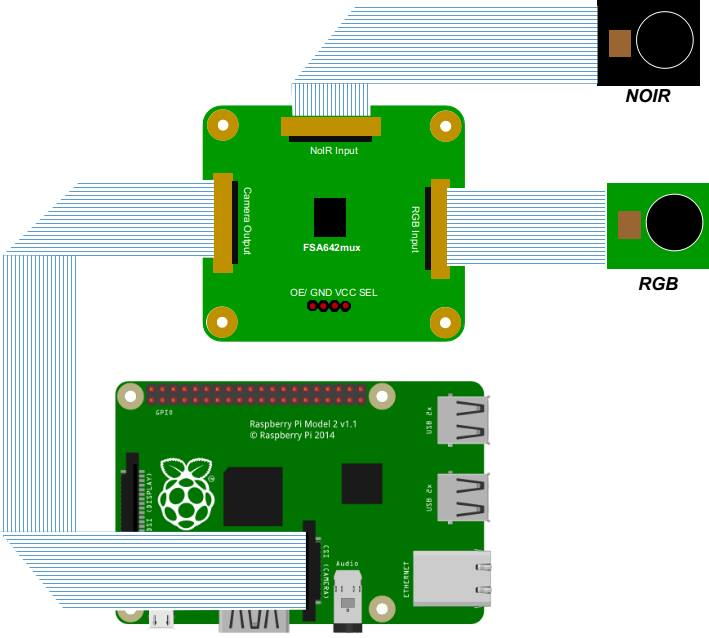
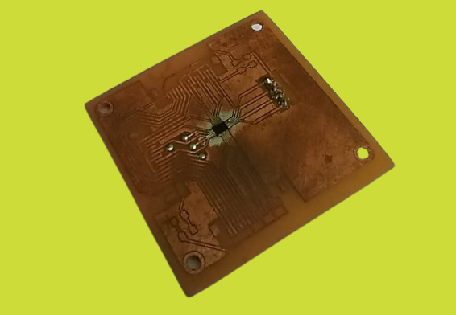
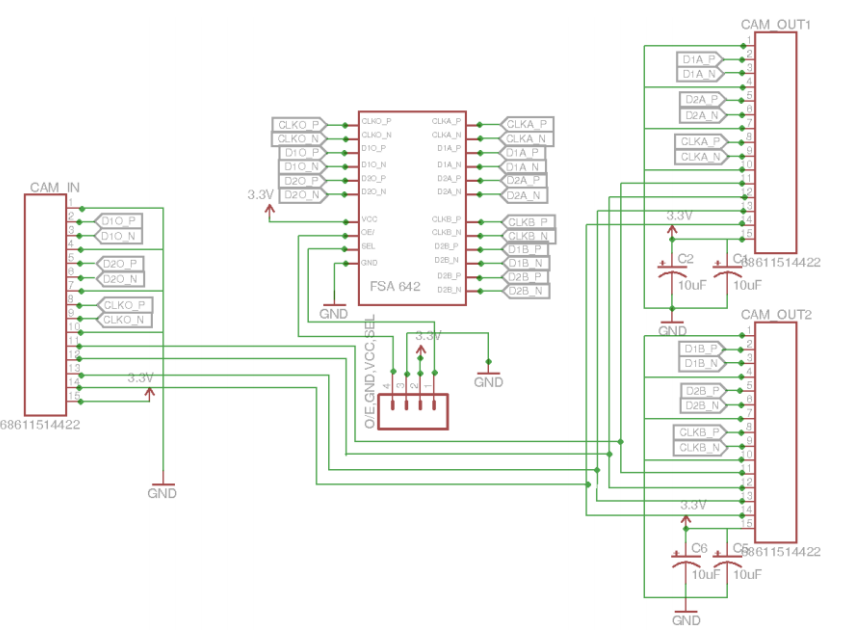

# RaspberryPi Multi Camera Adapter

- 2 x 5MP RPi Camera Module Rev 1.3 (Omnivision 5647)
- High Speed MIPI Switching using FSA642 chip

### Streaming Output using Flask MJPEG + OpenCV

### Wiring Diagram 

### DIY Multi Camera Adapter 
- Inspired from Arducam Multi Camera Adapter Module https://www.arducam.com/product/multi-camera-v2-1-adapter-raspberry-pi/

### Schematic Diagram Board
- Captured from : https://repository.ipb.ac.id/handle/123456789/83564
